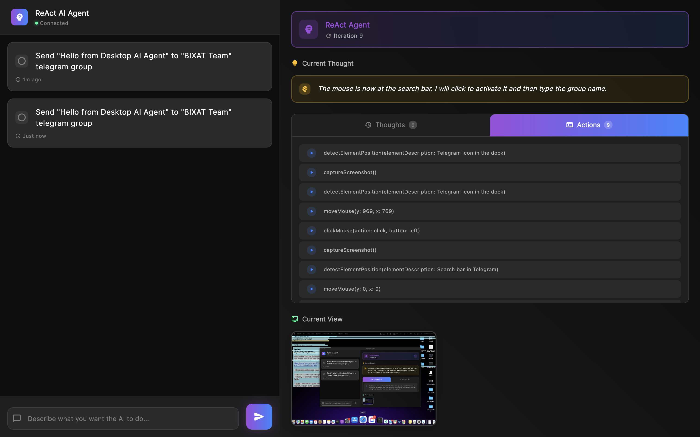
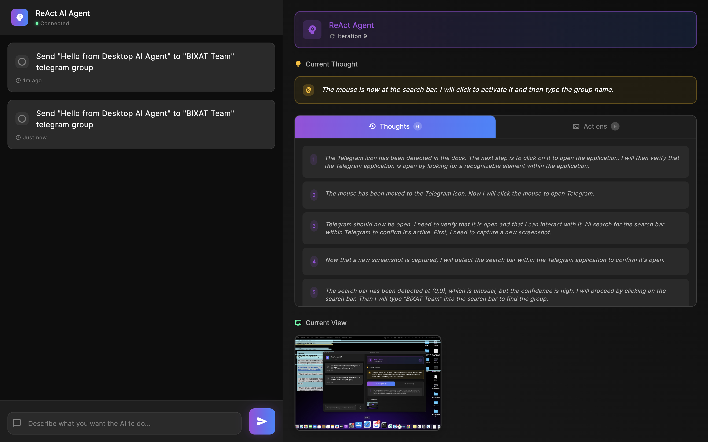

# ReAct AI Desktop Automation Agent

An intelligent desktop automation application powered by Google's Gemini AI that uses the **ReAct (Reasoning + Acting)** framework to understand and execute complex computer tasks through natural language commands.

## 🌟 Overview

This Flutter desktop application combines AI reasoning with computer vision and input control to automate desktop tasks. Simply describe what you want to do in natural language (e.g., "open Chrome and search for Flutter documentation"), and the AI agent will break it down into executable steps, reason about each action, and perform the automation.

## 📸 Screenshots

### Thoughts Tab

*The AI's reasoning process displayed in real-time with numbered thought steps*

### Actions Tab

*Execution log showing all function calls and their parameters*

## 🏗️ Project Structure

```
desktop_agent/
├── lib/
│   ├── main.dart                      # Application entry point (37 lines)
│   ├── config/
│   │   └── app_theme.dart            # Centralized theme & design system
│   ├── models/
│   │   ├── task.dart                 # Task data model (Isar)
│   │   ├── detection_result.dart     # UI element detection results
│   │   └── react_agent_state.dart    # ReAct agent state
│   ├── services/
│   │   ├── gemini_service.dart       # Gemini AI model initialization
│   │   ├── vision_service.dart       # AI-powered UI element detection
│   │   └── automation_service.dart   # All automation functions
│   ├── providers/
│   │   └── app_state.dart            # Main state management (Provider)
│   ├── screens/
│   │   └── main_screen.dart          # Main UI with responsive layout
│   ├── widgets/
│   │   └── task_card.dart            # Reusable task card widget
│   └── main.g.dart                   # Generated Isar database code
├── macos/                             # macOS platform-specific code
├── windows/                           # Windows platform-specific code
├── linux/                             # Linux platform-specific code
├── pubspec.yaml                       # Dependencies and project configuration
└── README.md                          # This file
```

### Architecture Overview

The application follows **separation of concerns** with a clean modular architecture:

#### 1. **Models** (`lib/models/`)
   - `Task`: Isar database model for storing automation tasks with thoughts and steps
   - `DetectionResult`: Model for UI element detection results with coordinates
   - `ReActAgentState`: State management for the ReAct reasoning cycle

#### 2. **Services** (`lib/services/`)
   - `GeminiService`: Initializes and configures Gemini AI model with function calling
   - `VisionService`: AI-powered UI element detection using Gemini or Qwen Vision API
   - `AutomationService`: Wrapper for all automation capabilities (mouse, keyboard, screen)

#### 3. **Providers** (`lib/providers/`)
   - `AppState`: Main state management using Provider pattern
     - Manages task execution state
     - Handles ReAct agent lifecycle
     - Stores execution logs and thought history
     - Manages database operations

#### 4. **Screens** (`lib/screens/`)
   - `MainScreen`: Primary interface with responsive layout
     - Adaptive design (800px breakpoint)
     - Side-by-side panels on large screens
     - Drawer navigation on small screens
     - Tabbed interface for thoughts and actions

#### 5. **Widgets** (`lib/widgets/`)
   - `TaskCard`: Reusable task card with animations and metrics

#### 6. **Configuration** (`lib/config/`)
   - `AppTheme`: Centralized design system
     - Material Design 3 theme
     - Color palette (Purple/Blue/Green)
     - 8px spacing system
     - Typography using Google Fonts Inter
     - Shadow and border radius constants

## 🧠 How It Works: The ReAct Framework

The application implements the **ReAct (Reasoning + Acting)** pattern, which combines reasoning and action in an iterative loop:

### ReAct Cycle

```
1. THOUGHT → 2. ACTION → 3. OBSERVATION → (repeat)
```

#### 1. **THOUGHT** (Reasoning Phase)
The AI agent analyzes the current state and decides what to do next:
- Understands the user's goal
- Considers what has been done so far
- Plans the next logical step

#### 2. **ACTION** (Acting Phase)
The agent executes one of the available automation functions:
- `captureScreenshot()`: Takes a screenshot to see the current state
- `detectElementPosition(description)`: Finds UI elements using AI vision
- `moveMouse(x, y)`: Moves cursor to coordinates
- `clickMouse(button, action)`: Performs mouse clicks
- `typeText(text)`: Types text via keyboard
- `pressKeys(keys)`: Presses keyboard shortcuts
- `wait(seconds)`: Waits for a specified duration

#### 3. **OBSERVATION** (Feedback Phase)
The agent receives feedback from the action:
- Success/failure status
- Element coordinates (for detection)
- Screenshot data
- Error messages

This cycle repeats until the task is complete or max iterations (20) is reached.

## 🔧 Technical Architecture

### 1. AI Integration (Gemini 2.5 Flash)

The application uses Google's Gemini AI with **function calling** capabilities:

```dart
GenerativeModel(
  model: 'gemini-2.5-flash',
  apiKey: apiKey,
  tools: [
    captureScreenshotTool,
    detectElementTool,
    moveMouseTool,
    clickMouseTool,
    typeTextTool,
    pressKeysTool,
    waitTool,
  ],
)
```

The AI can:
- Understand natural language instructions
- Reason about multi-step tasks
- Call automation functions with appropriate parameters
- Process visual information from screenshots

### 2. Computer Vision (UI Element Detection)

The `VisionService` supports **two vision providers** for UI element detection:

#### **Gemini Vision API** (Default)
- Uses Google's Gemini 2.5 Flash model
- Integrated with Google AI Studio
- Fast and reliable for most use cases

#### **Qwen Vision API** (Alternative)
- Uses Alibaba Cloud's Qwen 2.5 VL 72B Instruct model
- OpenAI-compatible API format
- Provides image size detection and confidence scores
- Configurable resolution parameters

**How it works:**
1. Takes a screenshot of the current screen
2. Sends the image + element description to the selected vision API
3. AI analyzes the image and returns pixel coordinates
4. Returns a `DetectionResult` with x, y coordinates and confidence score

Example:
```dart
final result = await VisionService.detectElementPosition(
  imageBytes,
  "blue Submit button",
);
// Returns: {x: 450, y: 320, confidence: 0.95}
```

**Switching Providers:**
Edit `lib/config/app_config.dart`:
```dart
static const String visionProvider = 'qwen';  // or 'gemini'
static const String qwenApiKey = 'sk-your-qwen-api-key';
```

See [QWEN_INTEGRATION.md](QWEN_INTEGRATION.md) for detailed setup instructions.

### 3. Input Automation

Uses the `bixat_key_mouse` package (custom Rust-based FFI) for:
- **Mouse Control**: Move cursor, click, double-click, right-click
- **Keyboard Control**: Type text, press keys, keyboard shortcuts
- **Screen Capture**: Take screenshots via `screen_capturer`

### 4. State Management (Provider)

The `AppState` class manages:
- Current task execution state
- Execution logs and thought logs
- Screenshot data
- Task history from database
- ReAct agent state (iteration count, current thought, observations)

### 5. Data Persistence (Isar Database)

Tasks are stored locally using Isar (NoSQL database):
```dart
@collection
class Task {
  Id id = Isar.autoIncrement;
  String prompt = '';
  List<String> thoughts = [];  // AI reasoning steps
  List<String> steps = [];     // Executed actions
  bool completed = false;
  DateTime createdAt = DateTime.now();
}
```

## 📦 Dependencies

### Core AI & Automation
- **google_generative_ai** (^0.4.3): Gemini AI integration with function calling
- **bixat_key_mouse**: Custom Rust-based FFI package for mouse/keyboard control
- **screen_capturer** (^0.2.1): Cross-platform screen capture functionality

### State Management & Storage
- **provider** (^6.1.1): State management using ChangeNotifier pattern
- **isar** (^3.1.0+1): Fast, local NoSQL database for task persistence
- **isar_flutter_libs** (^3.1.0+1): Isar platform-specific bindings

### UI & Design
- **flutter_animate** (^4.5.0): Declarative animations and transitions
- **google_fonts** (^6.1.0): Inter font family for typography
- **Material Design 3**: Modern design system with gradient themes

### Utilities
- **path_provider** (^2.1.1): Access to file system paths
- **uuid** (^4.2.1): Generate unique identifiers for tasks
- **image** (^4.5.4): Image processing and manipulation

### Development
- **build_runner** (^2.4.6): Code generation for Isar
- **isar_generator** (^3.1.0+1): Generates Isar database code

## 🚀 Getting Started

### Prerequisites
- Flutter SDK (>=3.0.0)
- Gemini API key from [Google AI Studio](https://makersuite.google.com/app/apikey)
- macOS, Windows, or Linux desktop environment

### Installation

1. **Clone the repository**
   ```bash
   git clone <repository-url>
   cd desktop_agent
   ```

2. **Install dependencies**
   ```bash
   flutter pub get
   ```

3. **Set up the bixat_key_mouse package**

   Ensure the `bixat_key_mouse_dart` package is available at:
   ```
   ../bixat_key_mouse_dart
   ```

4. **Configure API key**

   Copy the example config file and add your API key:
   ```bash
   cp lib/config/app_config.dart.example lib/config/app_config.dart
   ```

   Then open `lib/config/app_config.dart` and replace the API key:
   ```dart
   static const String geminiApiKey = 'YOUR_GEMINI_API_KEY_HERE';
   ```

5. **Generate Isar database code**
   ```bash
   flutter pub run build_runner build
   ```

6. **Run the application**
   ```bash
   flutter run -d macos  # or windows/linux
   ```


## 💡 Usage Examples

### Example 1: Simple Web Search
```
Input: "Open Chrome and search for Flutter documentation"

ReAct Process:
THOUGHT: I need to open Chrome first
ACTION: pressKeys(['cmd', 'space'])
OBSERVATION: Spotlight opened

THOUGHT: Now type Chrome to search for it
ACTION: typeText('Chrome')
OBSERVATION: Text typed successfully

THOUGHT: Press Enter to open Chrome
ACTION: pressKeys(['enter'])
OBSERVATION: Chrome is opening

THOUGHT: Wait for Chrome to load
ACTION: wait(2)
OBSERVATION: Waited 2 seconds

THOUGHT: Now I need to click on the address bar
ACTION: captureScreenshot()
OBSERVATION: Screenshot captured

THOUGHT: Detect the address bar
ACTION: detectElementPosition('address bar at the top')
OBSERVATION: Found at x:500, y:100

THOUGHT: Click on the address bar
ACTION: moveMouse(500, 100)
ACTION: clickMouse('left', 'click')
OBSERVATION: Clicked successfully

THOUGHT: Type the search query
ACTION: typeText('Flutter documentation')
ACTION: pressKeys(['enter'])
OBSERVATION: Task complete
```

### Example 2: File Operations
```
Input: "Create a new text file named 'notes.txt' on the desktop"
```

### Example 3: Application Control
```
Input: "Take a screenshot and save it"
```

## 🎯 Key Features

### ✅ Implemented

- ✅ Natural language task understanding
- ✅ ReAct reasoning framework (Thought → Action → Observation)
- ✅ AI-powered UI element detection using computer vision
- ✅ Mouse and keyboard automation
- ✅ Screenshot capture and analysis
- ✅ Task history and persistence (Isar database)
- ✅ Multi-step task execution with iteration control
- ✅ Real-time execution logs and thought visualization
- ✅ Responsive desktop interface

### 🔮 Future Enhancements
- [ ] Multi-monitor support
- [ ] Task templates and macros
- [ ] Voice command input
- [ ] Task scheduling and automation
- [ ] Error recovery and retry logic
- [ ] Performance optimization
- [ ] Plugin system for custom actions
- [ ] Cloud sync for task history
- [ ] Dark/Light theme toggle
- [ ] Export task history to JSON/CSV

## 🏛️ Code Organization

The project follows a clean, modular architecture with clear separation of concerns:

- **Models**: Data structures for tasks, detection results, and agent state
- **Services**: AI integration, vision processing, and automation functions
- **Providers**: State management using Provider pattern
- **Screens**: Main UI with responsive layout
- **Widgets**: Reusable UI components
- **Config**: Centralized theme and design system

## 🔒 Security & Privacy

- **API Key**: Store your Gemini API key securely (use environment variables in production)
- **Local Processing**: All automation runs locally on your machine
- **Data Storage**: Task history is stored locally using Isar database
- **Screenshots**: Temporary screenshots are kept in memory and not persisted
- **No Telemetry**: No data is sent to external servers except Gemini API calls
- **Permissions**: Requires accessibility permissions for automation (user-controlled)


## ⚠️ Known Limitations

### Element Detection Accuracy
The `detectElementPosition` function uses AI vision to locate UI elements, but it's **not always precise**:
- **Accuracy varies**: Detection may be off by several pixels or fail entirely
- **Complex UIs**: Elements in dense or overlapping layouts are harder to detect
- **Similar elements**: May confuse similar-looking buttons or icons
- **Recommendation**: Use keyboard shortcuts (`pressKeys`) whenever possible instead of relying on mouse clicks with element detection
- **Workaround**: Provide very specific descriptions (e.g., "blue Submit button in bottom right corner" instead of just "Submit button")

This is a limitation of the current AI vision model and may improve with future updates.

## 🐛 Troubleshooting

### Common Issues

1. **"Failed to detect element"**
   - **Note**: Element detection is not always precise and may fail
   - Use keyboard shortcuts instead of mouse clicks when possible
   - Ensure the element description is very clear and specific
   - Try taking a screenshot first to verify the UI state
   - Check that the element is visible on screen
   - Improve description with more details (e.g., "blue Submit button in bottom right corner with white text")

2. **"API key error"**
   - Verify your Gemini API key is valid
   - Check your internet connection
   - Ensure you haven't exceeded API quotas
   - Update the API key in `lib/services/gemini_service.dart`

3. **Mouse/keyboard not working**
   - Grant accessibility permissions to the app (System Preferences → Security & Privacy)
   - Check that `bixat_key_mouse` package is properly installed
   - Verify platform-specific permissions
   - Restart the application after granting permissions

4. **UI not responsive**
   - Resize the window to trigger responsive breakpoints
   - Check that the window width crosses the 800px threshold
   - Restart the app if drawer doesn't appear on small screens

5. **Animations not smooth**
   - Ensure you're running in release mode for best performance
   - Check system resources (CPU/Memory)
   - Disable animations in `main_screen.dart` if needed


## 🤝 Contributing

Contributions are welcome! Please feel free to submit a Pull Request.

## 📧 Contact

https://bixat.dev

---

**Built with ❤️ using Flutter and Google Gemini AI**
